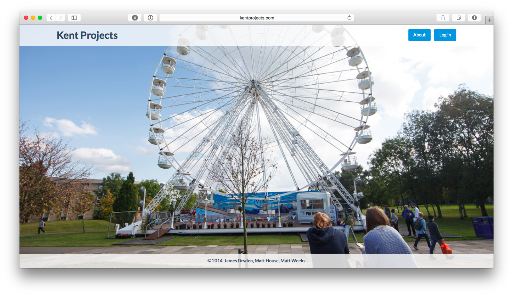

# KentProjects

Working closely with [Matt House](https://matthewhou.se) and [Matt Weeks](https://matt.weeks.codes) in my final year of
University, we built a web-platform for our dissertation to help new third-year students looking for groups &
final-year-projects. I focused on the backend service, writing the entire stack in PHP (better the devil you know),
building my own framework as I went along, and I'm pleased to say the entire project is open-sourced on Github 😎

- [`github.com/kentprojects`](https://github.com/kentprojects)
- [`kentprojects.github.io`](https://kentprojects.github.io)
